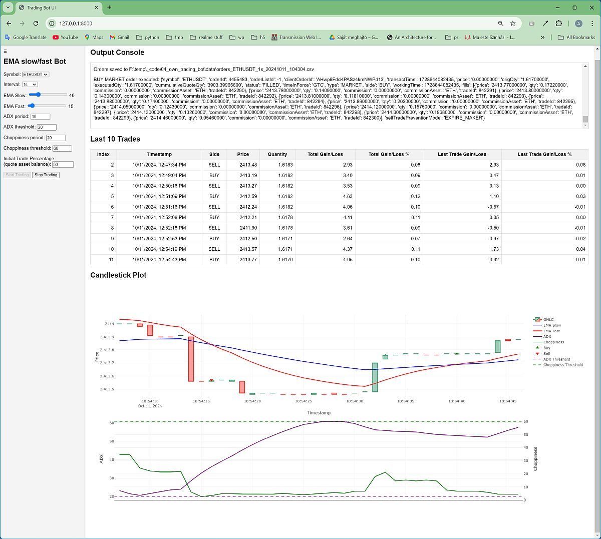

<h1 align="center"><strong>Cryptocurrency Trading Bot</strong></h1>

<p align="center">
  
</p>

<p align="center">
  <a href="https://youtu.be/Ew9yWHxiJJs">
    
  </a>
</p>

<p align="center">
  <a href="https://youtu.be/Ew9yWHxiJJs">Cryptocurrency Trading Bot</a>
</p>

This project focuses on using a trading bot for the cryptocurrency market, connected through a Binance account and API. The bot automatically trades Bitcoin and Ethereum based on configured indicators (EMA, ADX, Choppiness Index) and displays key data like trades and charts in the UI.

## Features

- **Real-time trading**: Connects to the Binance WebSocket API to receive cryptocurrency price data and make trading decisions.
- **EMA Crossover Strategy**: Uses the EMA crossover strategy to trade based on the movement of slow and fast EMAs.
- **Customizable**: Supports configuration for various cryptocurrency pairs, time intervals, and EMA lengths.
- **Backtesting**: The repository provides a Jupyter notebook for backtesting strategies on historical data.
- **User Interface**: The app features an HTML template and a JavaScript file for handling WebSocket connections and updating the user interface.
- **Additional Indicators**: Incorporates Average Directional Index (ADX) and Choppiness Index for enhanced decision-making.

## How it Works

The core of the bot is the `TradingBot` class, which handles the WebSocket connection to Binance and processes the price data. The bot is initialized with a cryptocurrency symbol and a price data interval. The `on_message` method updates the bot's state with each WebSocket message.

The EMA Crossover Bot uses the following steps to operate:
1. **Select Crypto/Currency Pair**: Choose from available cryptocurrency pairs (e.g., BTC/USDT).
2. **Candlestick Time Period**: Select the desired time period for candlesticks (e.g., 1m, 5m, 1h).
3. **Set EMA Lengths**: Configure the lengths for slow and fast EMAs.
4. **Set ADX and Choppiness Parameters**: Configure the periods and thresholds for ADX and Choppiness Index.
5. **Start Trading**: Upon clicking the "Start Trading" button, the bot begins trading using real-time data.

The app displays important messages such as initialization, trade execution, and any errors in an **Output Console**. Additionally, the **Candlestick Plot** visualizes the real-time data, and the **Last 10 Trades** table shows details of recent trades including profit or loss.

## Data Saving

The app saves data at several points during its operation:

1. **Orders**: Saved in the "data" subfolder as a CSV file with the format: `orders_crypto/currency_candlestick_length_date_time.csv`.
2. **Historical Data**: When fetching historical data for initialization, it's temporarily stored in memory.
3. **Backtest Results**: The backtest.py script saves results of parameter testing in both CSV and pickle formats.

## Backtesting

The `backtest.py` file contains a `BacktestTradingBot` class that simulates trading on historical data. It allows for testing different combinations of parameters (EMA lengths, ADX, and Choppiness settings) to find optimal configurations. The script saves the results of these tests, including performance metrics like final balance and win rate.

## Jupyter Notebooks

1. **backtest_trading_bot_strategy.ipynb**: 
   This notebook provides an interactive environment for backtesting the trading strategy. It allows users to:
   - Load historical data
   - Implement and test the EMA crossover strategy
   - Visualize results with charts and performance metrics
   - Optimize strategy parameters

2. **test_binance_api.ipynb**:
   This notebook is designed for testing the Binance API connection and basic functionalities. It includes:
   - Setting up the Binance client
   - Fetching account information
   - Retrieving market data
   - Placing test orders
   - Handling API responses and errors
   
These notebooks serve as valuable tools for strategy development, API testing, and understanding the bot's behavior in different market conditions.  
Note: in the data folder, there are some historical data files and backtest results for testing. The JSON files are the parameters used for backtesting for the data in the corresponding csv and pickle files.

## Installation

1. Clone the repository:
   ```bash
   git clone https://github.com/accaderi/Trading-bot-for-binance
   cd Trading-bot-for-binance
   ```

2. Create a virtual environment:
   ```bash
   python -m venv venv
   ```

3. Activate the virtual environment:
   - On Windows:
     ```bash
     venv\Scripts\activate
     ```
   - On macOS and Linux:
     ```bash
     source venv/bin/activate
     ```

4. Install the required dependencies:
   ```bash
   pip install -r requirements.txt
   ```

5. Set up the database:
   ```bash
   python manage.py migrate
   ```

6. Create a superuser (optional, but recommended for admin access):
   ```bash
   python manage.py createsuperuser
   ```

8. Run the Django development server in Daphne:
   ```bash
   daphne trading_bot_project.asgi:application
   ```

9. Open a web browser and navigate to `http://127.0.0.1:8000` to access the application.

Note: For production deployment, additional steps such as setting up a production-ready web server (e.g., Gunicorn) and configuring environment variables for sensitive information (like API keys) are recommended.

## Configuration

Before running the bot, make sure to configure the following:

- **api_key**: Your Binance API key.
- **api_secret**: Your Binance secret key.

These configurations can be set in the `.env` file.  
Note: testnet=True parameter should be added to the Client initialization if testing on testnet.

## Output

- **Output Console**: Displays important messages such as trade executions and error alerts.
- **Candlestick Plot**: Updates in real time with the current candlestick data based on the selected EMA length.
- **Last 10 Trades Table**: Displays details of the last 10 trades including trade ID, type (Buy/Sell), price, time, and profit/loss.

## License

This project is licensed under the MIT License.

## Acknowledgments

This project utilizes the following libraries:

- **Django**: A high-level Python web framework.
- **websocket-client**: A WebSocket client library for Python.
- **pandas**: A data analysis library for Python.
- **plotly.js**: A JavaScript library for creating interactive charts.

The project is inspired by the Binance WebSocket API documentation and the `websocket-client` library.

## Disclaimer

Trading cryptocurrencies involves risk. Ensure you understand these risks and have sufficient funds to cover potential losses. Based on testing, this bot can potentially generate 20-30% annual returns with proper settings, but results may vary. Always use caution and never invest more than you can afford to lose.  

This application is intended for educational purposes only. If you plan to use it in a production environment, please ensure that you implement appropriate risk management practices. Additionally, use a secure and reliable WebSocket client library, and conduct thorough debugging and testing.
